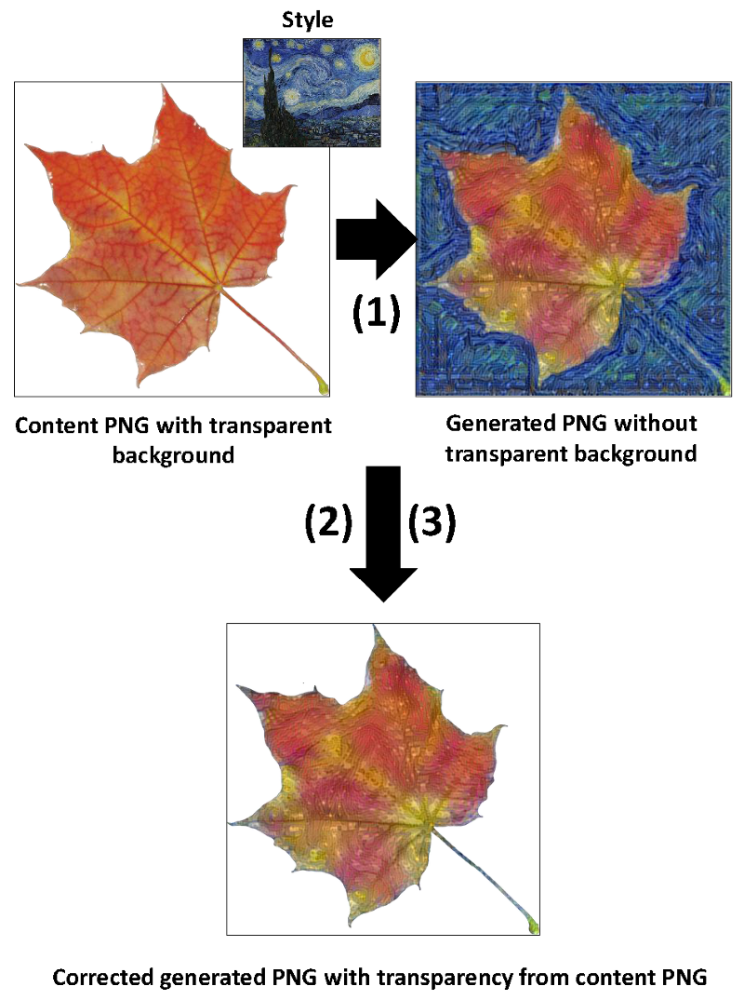

# DL-Art4Transparency
Deep Learning Art Transfer for Transparent PNGs

## Target Users

* Graphical designers
* Game designers
* Fashion designers

## Problem to solve

In the previous repo, mDL-ArtTransfer: Deep Learning Art Transfer using Multiple AIs (https://github.com/muntisa/mDL-ArtTransfer), I detected problems with the Art Transfer AIs in the case of PNG due to the transparency. Generally, the transparent background was filled with style patterns and, therefore, the transparent background disappears.

## Solution

DL-Art4Transparency has three steps:
1) Art transfer using Deep Learning (`fchollet_neural_style_transfer.py`) - transfer of style patterns into a content image, resulting a generating image; this is based on the fchollet's AI: https://github.com/keras-team/keras/blob/master/examples/neural_style_transfer.py.
2) Resize the content PNG keeping the transparency (`PngResizeTransparency.py`) by using the size of the generated image.
3) Transfer the transparency of the resized content PNG to the generated image (`PngTransfTransparency.py`), resulting a corrected image.

## Use

Just call the main py script (`python DL-Art4Transparency.py`) and keep the folder structure of the repo. This will use only 10 iterations for fast testing of the scripts.

Parameters:

* `--content_folder`   = Folder with content images to transform; default ='contents'
* `--style_folder`     = Folder with style images to use; default='styles'
* `--output_folder`    = Folder to store the generated image without correction; default='outputs'
* `--resized_folder`   = Folder to store the resized content images; default='contents_resized'
* `--corrected_folder` = Folder to store final corrected generated images; default='outputs_corrected'
* `--iterations`       = Number of iterations to run the optimizer; default = 10

## Example

This is the correction of the problem found in the previous repo: the content PNG is the Autumn Leaf and the style is represented by Starry Night (Van Gogh). I used only 10 iterations to just demonstrate the idea of this repo. The transfer of the transparency from the content resized PNG affects all the pixels in the corrected generated PNG (not only the transparent background).

Note: additional exampes will be added soon!

Enjoy the deep learning application in Art!
